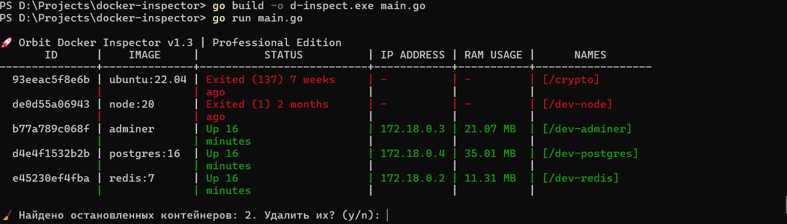

# 🚀 Orbit Docker Inspector


**Orbit Docker Inspector** — это легковесный и мощный CLI-инструмент на языке Go, предназначенный для быстрого аудита и мониторинга локальных Docker-контейнеров.



## ✨ Ключевые возможности
- **Мониторинг RAM в реальном времени:** Точные данные о потреблении памяти каждым контейнером.
- **Сетевой анализ:** Мгновенное отображение IP-адресов внутри Docker bridge.
- **Интерактивная очистка:** Умный помощник предложит удалить остановленные (Exited) контейнеры одной кнопкой.
- **Цветовая индикация:** Визуальное разделение статусов (Up/Exited) для быстрого считывания информации.

## 🛠 Технологический стек
- **Язык:** Golang
- **SDK:** Official Docker Engine API (Moby)
- **Библиотеки:** `tablewriter` для рендеринга таблиц, `fatih/color` для стилизации вывода.

## 📥 Установка и запуск

> **Важно:** Перед запуском убедитесь, что Docker Desktop запущен.

### Способ 1: Готовый файл (Windows)
1. Перейдите в раздел [Releases](https://github.com/mordaHQ/docker-inspector/releases).
2. Скачайте последнюю версию `d-inspect.exe`.
3. Запустите его в терминале (PowerShell или CMD).

### Способ 2: Из исходного кода
```bash
# Клонировать репозиторий
git clone [https://github.com/mordaHQ/docker-inspector.git](https://github.com/mordaHQ/docker-inspector.git)

# Перейти в папку
cd docker-inspector

# Установить зависимости
go mod tidy

# Запустить
go run main.go
